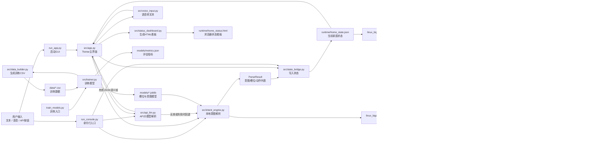

# 项目文件功能对照与协作图

本文档用于说明智能家居控制助手中各文件的职责，以及它们之间的数据流和调用关系。

## 主要文件功能对照表

| 文件路径 | 负责功能 | 主要输入 | 主要输出或影响 | 配合关系 |
| --- | --- | --- | --- | --- |
| `run_app.py` | 桌面版程序启动入口 | 用户运行 `python run_app.py` | 创建 Tkinter 主界面 | 调用 `src/app.py` 的 `main()` |
| `run_console.py` | 命令行控制台入口 | 终端输入的中文指令、可选 `--api` 参数 | 控制台解析结果、共享状态文件更新 | 调用 `src/intent_engine.py`、`src/api_llm.py`、`src/state_bridge.py` |
| `train_models.py` | 模型训练入口脚本 | 项目模板数据配置 | `models/*.joblib`、`models/metrics.json` | 调用 `src/trainer.py` |
| `src/app.py` | Tkinter GUI 主界面 | 文本框输入、按钮点击、语音识别结果、API 返回结果 | 识别结果展示、执行日志、状态看板刷新 | 连接 `intent_engine.py`、`api_llm.py`、`voice_input.py`、`state_bridge.py`、`status_dashboard.py` |
| `src/intent_engine.py` | 本地智能家居意图解析核心 | 中文自然语言指令、训练好的模型 | `ParseResult` 解析结果和设备动作列表 | 读取 `models/*.joblib`，输出给 GUI、控制台和侧车回放脚本 |
| `src/api_llm.py` | 可选 API 大模型解析 | 指令文本、API Key、模型配置 | 结构化 JSON 语义帧转换后的 `ParseResult` | API 失败或结果无效时可回退到 `intent_engine.py` |
| `src/state_bridge.py` | 家居状态文件读写和动作执行 | `ParseResult.commands` | `runtime/home_state.json` | 被 GUI、控制台和 HTML 看板使用，也是大数据侧车的数据源 |
| `src/status_dashboard.py` | HTML 状态看板生成 | 当前状态字典、房间设备清单、本次操作设备 | `runtime/home_status.html` | 由 `src/app.py` 调用，浏览器每 2 秒自动刷新 |
| `src/voice_input.py` | 可选语音输入 | 麦克风录音 | 中文文本指令 | GUI 将识别出的文本交给本地解析流程 |
| `src/data_builder.py` | 自动构造训练数据集 | 房间、设备、动作模板和负样本模板 | `data/binary_intent_dataset.csv`、`data/multi_slot_dataset.csv` | 被 `src/trainer.py` 调用 |
| `src/trainer.py` | 训练二分类模型和槽位分类模型 | `data/*.csv` 训练数据 | 模型文件和评估指标 | 被 `train_models.py` 或 GUI 首次启动时调用 |
| `src/__init__.py` | 标记 `src` 为 Python 包 | 无 | 允许其他脚本按包导入模块 | 支持 `from src...` 导入方式 |
| `data/binary_intent_dataset.csv` | 二分类训练数据 | `data_builder.py` 生成 | 用于判断是否为家居控制指令 | 供 `trainer.py` 训练 `binary_intent_model.joblib` |
| `data/multi_slot_dataset.csv` | 槽位训练数据 | `data_builder.py` 生成 | 用于地点、设备、动作分类 | 供 `trainer.py` 训练三个槽位模型 |
| `models/binary_intent_model.joblib` | 家居控制二分类模型 | 指令文本特征 | 家居控制/非家居控制判断 | 由 `intent_engine.py` 加载 |
| `models/location_model.joblib` | 地点槽位分类模型 | 指令文本特征 | 房间预测结果 | 由 `intent_engine.py` 在规则缺失时补充 |
| `models/device_model.joblib` | 设备槽位分类模型 | 指令文本特征 | 设备预测结果 | 由 `intent_engine.py` 在规则缺失时补充 |
| `models/action_model.joblib` | 动作槽位分类模型 | 指令文本特征 | 打开/关闭预测结果 | 由 `intent_engine.py` 在规则缺失时补充 |
| `models/metrics.json` | 模型评估指标 | 训练与测试集预测结果 | 各模型准确率和分类报告 | 由 `trainer.py` 写入，报告中可引用 |
| `runtime/home_state.json` | 当前家居状态共享文件 | GUI 或控制台执行后的设备动作 | 当前各房间设备开关状态、最近指令 | 被 GUI、HTML 看板和大数据侧车读取 |
| `runtime/home_status.html` | 浏览器版状态看板 | `status_dashboard.py` 渲染结果 | 可视化房间设备状态页面 | 由 GUI 打开，页面自动刷新 |
| `linux_bigdata/event_collector.py` | 状态变化事件采集器 | `runtime/home_state.json` | `linux_bigdata/data/events.jsonl` | 持续监听状态文件，但不反向修改主程序 |
| `linux_bigdata/command_replay.py` | 演示事件生成脚本 | 预设样例指令 | `linux_bigdata/data/events.jsonl` | 复用 `intent_engine.py`，方便无 GUI 时生成测试数据 |
| `linux_bigdata/show_events.py` | 事件日志预览工具 | `events.jsonl` | 终端表格输出 | 用于快速检查事件是否生成正确 |
| `linux_bigdata/batch_analyze.py` | 批处理统计分析 | `events.jsonl` | 多个 CSV 汇总表和 `report.md` | 生成房间、设备、动作、小时维度统计 |
| `linux_bigdata/show_report.py` | 报告查看工具 | `linux_bigdata/output/report.md` | 终端打印 Markdown 报告 | 方便 Windows/PowerShell 查看 UTF-8 中文报告 |
| `linux_bigdata/stream_window.py` | 简化流式窗口统计 | 持续追加的 `events.jsonl` | 最近窗口内房间 Top3、设备 Top3 | 模拟 Kafka/Flink 实时统计思想 |
| `linux_bigdata/linux/bootstrap_linux.sh` | Linux 侧车环境初始化 | Linux shell 环境 | `.venv-linux-bigdata` 虚拟环境 | 安装运行侧车所需依赖 |
| `linux_bigdata/linux/run_pipeline_demo.sh` | Linux 一键演示脚本 | shell 执行命令 | 事件、统计报表、窗口统计输出 | 串联 `command_replay.py`、`batch_analyze.py` 等脚本 |
| `linux_bigdata/linux/run_collector.sh` | Linux 事件采集启动脚本 | shell 执行命令 | 持续运行采集器 | 调用 `event_collector.py` |
| `linux_bigdata/linux/smart-home-bigdata.service` | systemd 服务模板 | Linux systemd | 后台持续采集状态事件 | 部署时把 `event_collector.py` 注册成服务 |
| `requirements.txt` | 核心依赖列表 | `pip install -r requirements.txt` | 安装 pandas、scikit-learn、joblib 等 | 支持训练、解析和主程序运行 |
| `requirements-voice.txt` | 语音功能可选依赖 | `pip install -r requirements-voice.txt` | 安装 SpeechRecognition 等 | 支持 `voice_input.py` |
| `README.md` | 项目总说明 | 项目实际功能与运行方式 | 面向使用者的快速开始文档 | 引导运行 GUI、训练、API 和大数据侧车 |
| `linux_bigdata/README.md` | 大数据侧车说明 | 侧车模块文件和命令 | 独立说明事件链路和 Linux 运行方式 | 补充主 README 的大数据部分 |
| `docs/新手读代码指南-名词解释与主流程.md` | 面向初学者的代码阅读指南 | 项目源码和常见专业名词 | 阅读顺序、名词解释、主流程说明 | 建议先读它，再读代码注释 |

## 文件协作 Mermaid 图

## 运行链路说明

1. GUI 启动后，`src/app.py` 会检查模型是否存在；如果缺少模型，会调用 `src/trainer.py` 自动训练。
2. 用户输入普通文本时，GUI 和控制台都会调用 `src/intent_engine.py`，解析出意图、地点、设备、动作和可执行命令。
3. 用户选择 API 模型解析时，`src/api_llm.py` 先请求 DeepSeek/OpenAI-compatible 接口，再把 JSON 语义帧转换为统一的 `ParseResult`。
4. 解析结果进入 `src/state_bridge.py` 后，系统会更新 `runtime/home_state.json`，这是 GUI 看板、HTML 看板和大数据侧车共用的数据文件。
5. `src/status_dashboard.py` 根据状态文件生成 `runtime/home_status.html`，浏览器每 2 秒刷新一次。
6. `linux_bigdata/event_collector.py` 只读取状态文件并追加事件日志，不会修改主程序状态。
7. 大数据侧车的 `batch_analyze.py` 和 `stream_window.py` 基于 `events.jsonl` 分别完成批处理统计和实时窗口统计演示。
